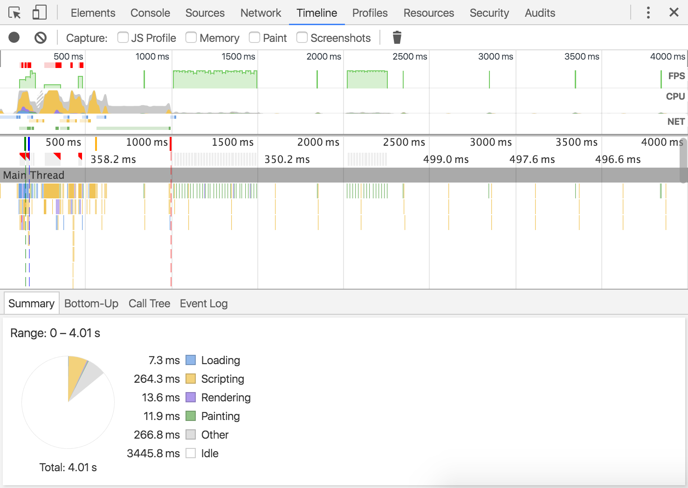
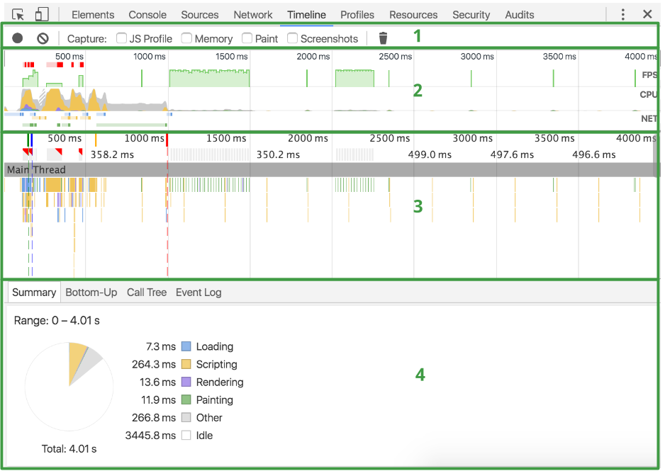
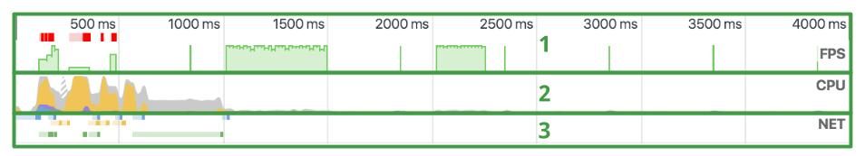
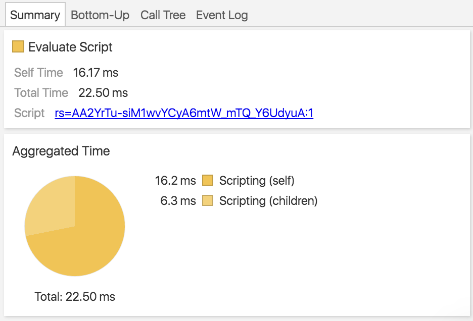
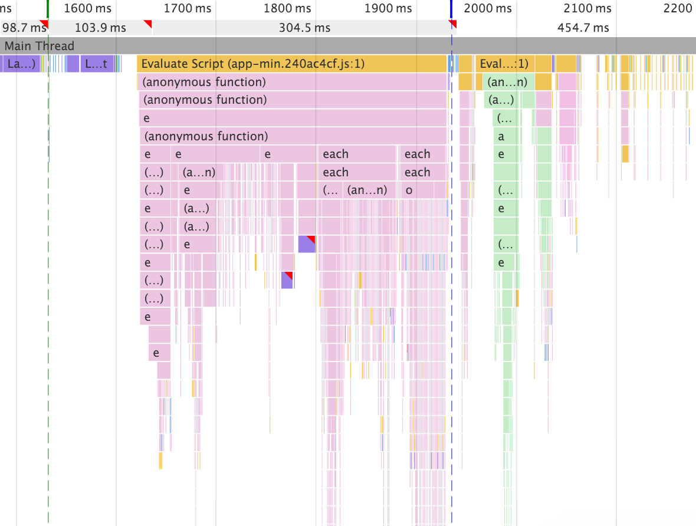

### chrome浏览器Timeline时间轴使用

Timeline时间轴主要分成三个部分，工具栏，顶部时间轴和记录视图。

* 原型按钮 运行监听，点亮按钮后可以获得页面监听信息和执行数据状态
* 禁止图案 清除所有的监听信息
* Capture 希望抓去的信息，多选`JS Profile` 堆栈 `Memory`内存信息 `Paint`绘制 `Screenshots`内存快照
#### 时间轴面板概览（Timeline panel overview）

1. controls-控制区：开始一个时间轴，停止一个时间轴，制定在录制时间要截取的信息；
2. overview-视图：记录时间轴trace的页面信息的概括
3. Flame Chart-瀑布图：一个虚拟的cpu栈的详细信息追踪:
    * 蓝色-对应`DOMContentLoaded`事件；
    * 绿色-对应第一次绘制的响应时间；
    * 红色-对应`load`事件；
4. Details-详细信息：当一个事件被选择之后，面板会显示对应的事件信息，如果没有事件被选择，面板显示的是所处事件段的信息；

##### 视图区（Overview pane）

1. FPS. Frames Per Second，绿条越高，FPS越高，红块表示长帧；
2. CPU. cpu资源，这部分视图去展示的是每个类型的事件占用的cpu资源；
3. NET. 每一种颜色的长条都对应一种资源，条越长说明获取资源的时间越长，每个长条浅色的部分对应的是等待时间（从请求资源到第一个byte到达开始下载为止），长条暗色的部分对应传输时间（从开始下载第一个字节到下载完毕）；

条形被颜色编码的意义如下所示:* HTML files - blue. * Scripts - yellow. * Stylesheets - purple. * Media files - green. * Miscellaneous resources - grey.

##### 记录过程 （Make a recording）
1. 自动记录：刷新页面，时间轴会自动记录页面加载信息；
2. 手动记录：点击Record((`Cmd`+`E` for mac `Ctrl`+`E` for windows)Record变红开始记录页面信息，操作页面，并在再次按下Record时停止记录。停止记录以后DevTools自动定位到页面记录部分；

Tips：
* 记录的时间要尽可能短：短的记录更容易分析
* 避免不必要的行为；
* 禁用cache缓存；
* 禁用extensions；

##### 详细信息（View recording details）
当在Flame Chart上选择一个事件， Detail面板会显示响应的信息

Summary是对所有事件类型的百分比，单一的则是对主要的事件的信息

##### JS资源（Profile JavaScript）

时间轴中的JavaScript堆，flame chart显示所有被调用的Javascript函数

#### 内存信息

内存信息中有四条曲线的变化
* 蓝色-JS堆数
* 红色-dom文档数
* 绿色-内存中的dom节点数
* 黄色-内存中的元素绑定数
